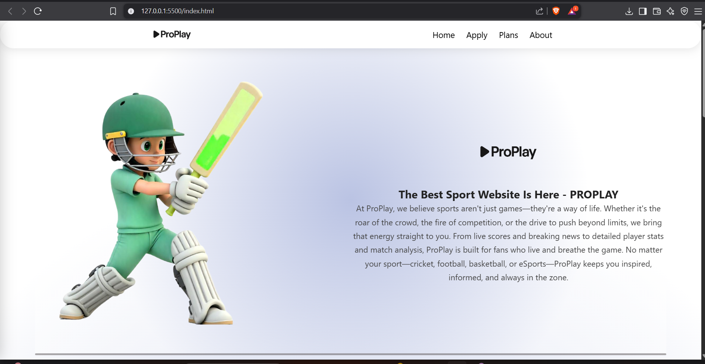
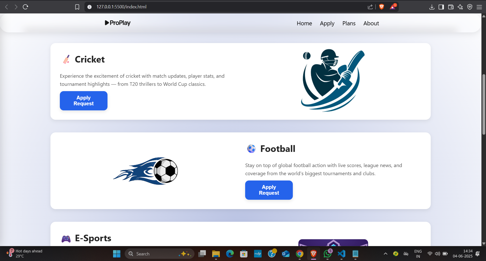
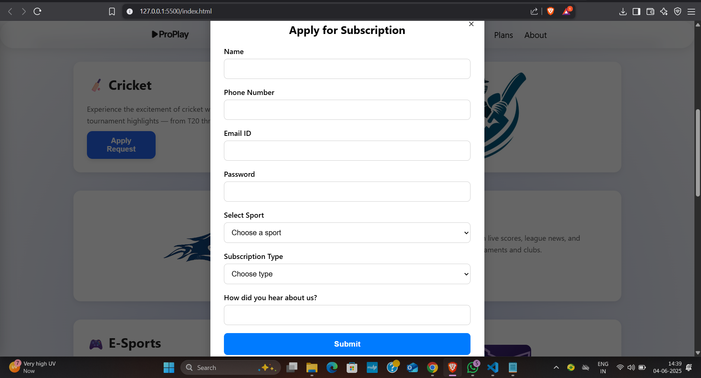

# 🏆 ProPlay – The Ultimate Sports Experience Website

**ProPlay** is a fully responsive, animated, and interactive sports-themed website. Built using pure HTML, CSS, and JavaScript (no libraries), it brings a dynamic and stylish interface for sports fans interested in Cricket, Football, Esports, and Chess.

---

## 🌐 Live Preview

👉 Coming Soon (host on GitHub Pages or Vercel)

---

## 📁 Project Structure

```
├── index.html        # Main HTML structure
├── style.css         # All styling including layout, animations, and responsiveness
├── script.js         # Modal toggle, mobile nav handling
├── assets/           # All images and icons (logos, sport images, social icons)
```

---

## 🚀 Features

- 🧊 **Glassmorphism-style navbar**
- 🧾 **Animated page load using pure CSS**
- 💡 **Responsive hamburger menu**
- ⚙️ **Sports subscription modal popup**
- 🧠 **Plans section with animated cards**
- 🧭 **Smooth scroll navigation**
- 🌈 **Gradient backgrounds and soft shadows**
- 📱 **Mobile-friendly layout**

---

## 💻 Tech Stack

- **HTML5**
- **CSS3** (Flexbox, Media Queries, Animations)
- **Vanilla JavaScript**

---

## 🖼️ Screenshots

> Add screenshots here once hosted or locally saved. Example:





---

## 📦 How to Use

1. Clone the repository:

```bash
git clone https://github.com/your-username/proplay.git
cd proplay
```

2. Open `index.html` in your browser or live server.

3. Customize `assets/` to update images or logos.

---

## ✨ Deployment

You can deploy this on:
- **GitHub Pages**
- **Vercel**
- **Netlify**

---

## 🧑‍💻 Author

**Aayush Bharda**  
🔗 [Instagram](https://www.instagram.com/aayush45__)  
🔗 [Twitter (X)](https://x.com/aayush_2005_)  
🔗 [LinkedIn](https://www.linkedin.com/in/aayush-bharda-399958311)

---

## 📃 License

This project is open-source and free to use for educational or personal purposes.

---

## ⭐ Show your support

If you like this project, don't forget to give it a ⭐ on GitHub!
